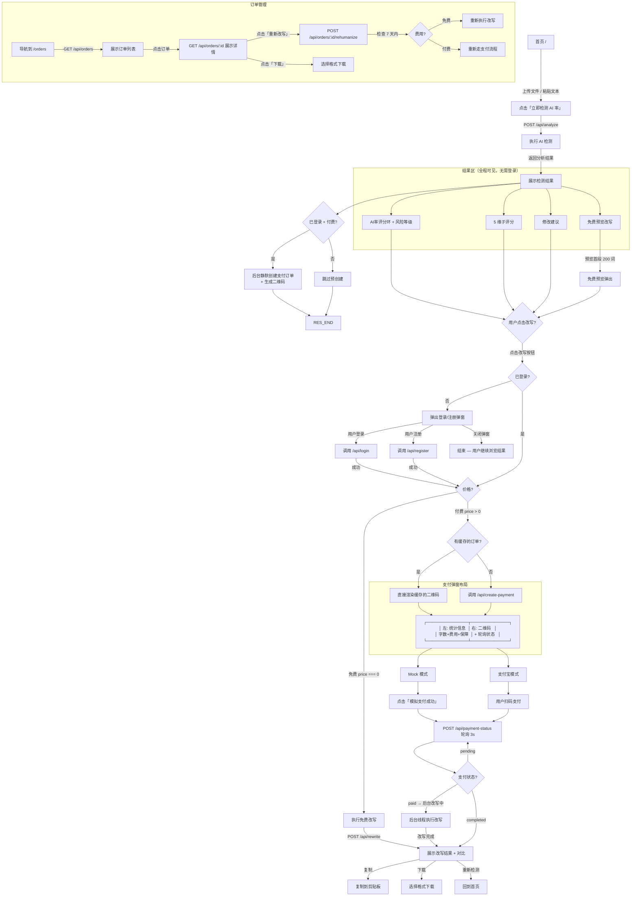

# 用户流程可视化

> **v2 - 渐进式交互流程**
> 核心原则：检测结果对匿名用户完全开放，登录/付费仅在用户主动点击改写时才触发。
> 上次更新: 2026-06-04



## 关键路径速览

### 路径 A：免费改写（≤500 词，未登录）— ⭐ 核心路径
```
首页 → 检测 → 展示结果（AI率+分析+建议）
  → 点击「登录后可改写」
    → 登录/注册 → 自动执行改写 → 展示对比结果
```
**关键体验**：用户看到 AI 率后再决定是否改写，不被登录框打断。

### 路径 B：免费改写（≤500 词，已登录）
```
首页 → 检测 → 展示结果（含改写按钮已激活「免费改写」）
  → 点击「免费改写」→ 立即改写 → 展示对比结果
```
**关键体验**：全程无弹窗，点改写即出结果。

### 路径 C：付费改写（>500 词，未登录）
```
首页 → 检测 → 展示结果（含价格预估）
  → 点击「付费改写 ¥XX」（按钮已显示价格）
    → 登录 → 弹出支付窗（二维码加载中... → 渲染）
    → 扫码支付 → 轮询 → 自动展示改写结果
```
**关键体验**：价格可见后再决定；登录后自动进入支付流程，无需再次点击。

### 路径 D：付费改写（>500 词，已登录）
```
首页 → 检测 → 展示结果（含价格预估）
  → 后台静默创建支付订单 + 生成二维码（零等待）
  → 点击「付费改写 ¥XX」
    → 弹出支付窗（二维码即时展示）
    → 扫码支付 → 轮询 → 自动展示改写结果
```

---

## 设计原则

| 原则 | 说明 |
|------|------|
| **检测零门槛** | 匿名用户可完整查看 AI 率、5 维子评分和修改建议，无需任何注册 |
| **改写需身份** | 仅改写操作需要登录/付费，入口在结果区引导 |
| **左右分栏支付** | 支付弹窗左栏统计信息（字数/费用/保障），右栏二维码+轮询状态 |
| **零等待支付** | 已登录付费用户: 检测完成后后台静默预创建订单+生成二维码，点击改写时直接展示，API 零等待 |
|  | 未登录付费用户: 登录后自动触发支付创建，二维码加载中过渡，无白屏 |
| **定价前置** | 用户在输入文本时即可看到实时字数与费用预估 |
| **预期明确** | 改写按钮的文字实时反映状态（登录后可改写 / 付费改写 ¥XX） |

## 后端关键路由表

| 路由 | 需登录 | 功能 | 触发时机 |
|------|--------|------|---------|
| `POST /api/analyze` | 否 | AI 检测 | 点击「立即检测」 |
| `POST /api/rewrite` | 是 | 免费改写 | 用户登录后自动触发 |
| `POST /api/create-payment` | 是 | 创建支付订单+生成二维码 | 点击「付费改写」 |
| `GET /api/payment-status/:id` | 是 | 轮询支付+改写状态 | 支付后 3 秒/次 |
| `POST /api/webhook/alipay` | 否(CSRF豁免) | 支付宝回调 | 支付宝异步通知 |
| `POST /api/test/mock-payment/:id` | 否 | 模拟支付成功 | Mock 模式测试 |
| `GET /api/orders` | 是 | 订单列表 | 导航到 /orders |
| `POST /api/orders/:id/rehumanize` | 是 | 重新改写 | 点击「重新改写」 |
| `GET /api/download/:id` | 视情况 | 下载结果 | 点击「下载」 |
| `GET /api/payment-config` | 否 | 获取支付适配器类型 | 页面加载 |
| `GET /api/extracted-text` | 是 | 获取已分析的文本 | 改写/支付时按需拉取 |

## Session 标记位

| 标记 | 设置位置 | 消费位置 | 用途 |
|------|---------|---------|------|
| `pendingFreeRewrite` | `handleAnalyzeResponse` | `auth.js` 登录/注册成功 | 登录后自动执行免费改写 |
| `pendingPaidAnalysis` | `handleAnalyzeResponse` / `createPaymentOrder` | `auth.js` 登录/注册成功 | 登录后自动弹出支付弹窗 |
| `pendingPaymentInfo` | `handleAnalyzeResponse` | `auth.js` 登录/注册成功 | 存储支付需要的字数/价格 |
| `lastExtractedText` | `handleAnalyzeResponse` / `showOverLimitUpgrade`（frontend sessionStorage） | `getCurrentText()` | 本地缓存的文本，改写时直接使用 |
| `last_text` | `api_analyze` | `api_rewrite` / `api_create-payment` | 改写和支付时读取文本（后端兜底） |
