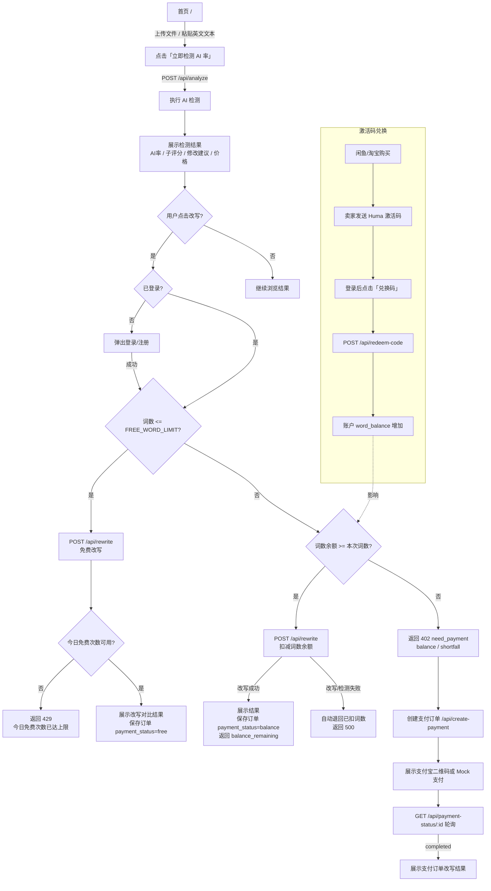

# 用户流程可视化

> **v3 - 免费额度 + 激活码余额 + 支付兜底流程**  
> 核心原则：检测结果对匿名用户开放；改写必须登录；超过免费额度时优先使用词数余额，余额不足再进入支付流程。  
> 上次更新: 2026-07-15

## 当前真实逻辑



## 关键路径

### 路径 A：匿名检测

```text
首页 → 上传/粘贴英文文本 → 检测 → 展示 AI 率、子评分、修改建议、预估价格
```

检测本身不要求登录。登录只在用户主动点击改写、查看订单、兑换激活码时触发。

### 路径 B：免费改写

```text
检测 → 点击改写 → 登录/已登录 → 文本词数 <= FREE_WORD_LIMIT
→ 检查今日免费次数 → 同步改写 → 展示结果
```

当前 `FREE_WORD_LIMIT` 来自 `config.py`，线上配置为 100 词；每日免费改写次数由 `FREE_DAILY_REWRITES` 控制，当前为 2 次。

### 路径 C：激活码余额改写

```text
购买兑换码 → 官网登录 → 点击「兑换码」→ 输入激活码
→ 账户增加词数余额 → 检测长文本 → 点击「使用余额改写」
→ 扣减对应词数 → 改写完成 → 返回剩余余额
```

安全细节：

- 激活码只能兑换一次，状态从 `unused` 变为 `redeemed`。
- 激活码兑换和余额增加在同一事务中完成。
- 余额扣减使用 `WHERE word_balance >= ?` 防并发超扣。
- 如果扣余额后改写或检测失败，系统会自动退回本次扣减词数。

### 路径 D：余额不足后支付

```text
检测长文本 → 点击改写 → 余额不足
→ /api/rewrite 返回 402 need_payment
→ 前端弹出支付窗口 → 创建支付订单 → 支付成功后后台改写
```

已登录用户检测完成后，如果余额足够，不预创建支付订单；余额不足时才预创建或创建支付订单。

## 关键路由

| 路由 | 需登录 | 功能 | 当前状态 |
|------|--------|------|----------|
| `POST /api/analyze` | 否 | AI 检测，返回词数、价格、分析结果 | 使用中 |
| `POST /api/rewrite` | 是 | 免费改写 / 余额改写 / 返回支付提示 | 使用中 |
| `POST /api/redeem-code` | 是 | 兑换激活码并增加词数余额 | 使用中 |
| `GET /api/user/balance` | 是 | 查询当前用户词数余额 | 使用中 |
| `POST /api/create-payment` | 是 | 创建支付宝/Mock 支付订单 | 余额不足时使用 |
| `GET /api/payment-status/:id` | 是 | 轮询支付和后台改写状态 | 支付流程使用 |
| `POST /api/webhook/alipay` | 否，CSRF 豁免 | 支付宝异步通知 | 生产支付使用 |
| `POST /api/test/mock-payment/:id` | 否 | Mock 模式模拟支付成功 | 开发测试使用 |
| `GET /api/orders` | 是 | 订单列表 | 使用中 |
| `POST /api/orders/:id/rehumanize` | 是 | 7 天内付费订单重新改写 | 使用中 |
| `GET /api/download/:id` | 视订单/登录状态 | 下载结果 | 使用中 |
| `GET /api/payment-config` | 否 | 获取支付适配器类型 | 使用中 |
| `GET /api/extracted-text` | 是 | 取已分析文本兜底 | 使用中 |

## 前端状态

| 状态 | 位置 | 用途 |
|------|------|------|
| `currentUser` | `static/auth.js` | 当前登录用户 |
| `nav-balance` | `templates/index.html` + `static/auth.js` | 导航栏显示词数余额 |
| `redeem-modal` | `templates/index.html` | 激活码兑换窗口 |
| `lastExtractedText` | frontend `sessionStorage` | 改写/支付时读取当前文本 |
| `precreatedPayment` | frontend `sessionStorage` | 已登录且余额不足时缓存预创建支付订单 |
| `pendingFreeRewrite` | frontend `sessionStorage` | 未登录点击免费改写后，登录成功自动继续 |
| `pendingPaidAnalysis` / `pendingPaymentInfo` | frontend `sessionStorage` | 未登录点击付费改写后，登录成功自动继续支付 |
| `last_text` | Flask session | 后端兜底文本 |

## 后台管理

`admin.py` 已增加「激活码」Tab：

- 生成激活码：数量 1-100，每码词数 100-100000。
- 查看总码数、已使用、未使用、已兑换词数。
- 列表展示激活码、词数、状态、兑换用户、创建时间、兑换时间。

## 已删除/废弃的旧理解

- “超过免费额度一定直接支付”已经废弃；现在先查词数余额。
- “已登录付费用户一定预创建支付订单”已经废弃；余额够时不预创建支付订单。
- `/api/rewrite` 不再只是免费改写接口；它现在承担免费改写、余额改写、余额不足支付提示三种分支。
