# AI Humanizer - 技术架构文档

> **版本**: v1.0 | **日期**: 2026-05-28 | **状态**: 已整合
>
> 整合来源：ARCHITECTURE.md + product-doc.md 第3章 + class-diagram.mermaid + sequence-diagram.mermaid

---

## 目录

- [1. 系统架构总览](#1-系统架构总览)
- [2. 技术栈](#2-技术栈)
- [3. 架构模式](#3-架构模式)
- [4. 数据模型](#4-数据模型)
- [5. API 接口](#5-api-接口)
- [6. 核心流程](#6-核心流程)
- [7. 检测引擎](#7-检测引擎)
- [8. 改写引擎](#8-改写引擎)
- [9. 文件结构](#9-文件结构)
- [10. 共享约定](#10-共享约定)
- [11. 任务列表](#11-任务列表)

---

## 1. 系统架构总览


### 分层架构

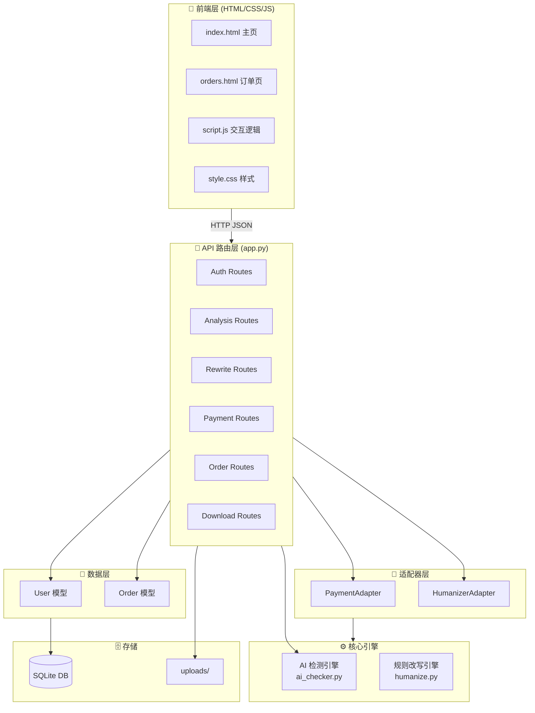

---

## 2. 技术栈

### 依赖矩阵

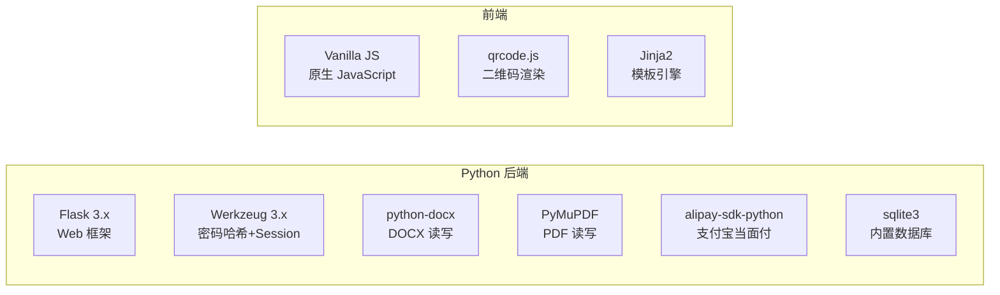

### 选型理由

| 库/框架 | 版本 | 用途 | 选型理由 |
|---------|------|------|----------|
| Flask | >=3.0,<4.0 | Web 框架 | 保持现有栈，零迁移成本 |
| Werkzeug | >=3.0,<4.0 | 密码哈希 + session | Flask 内置依赖 |
| python-docx | >=1.0,<2.0 | .docx 读写 | 标准 DOCX 处理库 |
| PyMuPDF | >=1.20,<2.0 | .pdf 读写 | 高性能 PDF 处理 |
| alipay-sdk-python | >=3.7,<4.0 | 支付宝当面付 | 官方 SDK |
| sqlite3 | Python 内置 | 数据库 | 零依赖，适合单机 |
| Vanilla JS | — | 前端 | 无框架依赖，轻量 |

---

## 3. 架构模式

### 3.1 核心设计模式

**模式一：MVC 分层**
- **Model**: `models.py` — User、Order 数据模型
- **View**: `templates/` — Jinja2 模板 (index.html, orders.html)
- **Controller**: `app.py` — 路由层，编排业务逻辑

**模式二：适配器模式 (Strategy)**
- `PaymentAdapter` — 统一支付接口，Mock / Alipay 可替换
- `HumanizerAdapter` — 统一改写接口，RuleBased / API 可替换

```mermaid
flowchart TB
    subgraph Payment["支付适配器"]
        PA[PaymentAdapter<br>抽象接口]
        MP[MockPaymentAdapter<br>开发测试]
        AP[AlipayPaymentAdapter<br>生产环境]
    end

    subgraph Humanizer["改写适配器"]
        HA[HumanizerAdapter<br>抽象接口]
        RH[RuleBasedHumanizer<br>当前使用]
        AH[ApiHumanizer<br>未来扩展]
    end

    App[Flask App] -.->|uses| PA
    PA <|-- MP
    PA <|-- AP
    App -.->|uses| HA
    HA <|-- RH
    HA <|-- AH
```

**模式三：异步后台任务**
- 支付 Webhook 回调中使用 `threading.Thread(daemon=True)` 异步执行改写
- 不阻塞支付宝回调响应，保证支付通知及时返回 "success"

### 3.2 核心技术挑战与应对

| 挑战 | 应对方案 |
|------|----------|
| 用户认证 | `werkzeug.security` 哈希密码 + Flask session |
| 订单持久化 | SQLite 存储，支持历史查询和 7 天重下载 |
| 格式保持输出 | python-docx 写 docx, PyMuPDF 写 pdf, 直接写 md/txt |
| 支付可扩展 | 适配器模式 — MockPaymentAdapter + AlipayPaymentAdapter |
| 改写引擎可替换 | 适配器模式 — 统一 HumanizerAdapter 接口 |
| 异步改写 | `threading.Thread` 后台执行，不阻塞 webhook |

---

## 4. 数据模型

### 4.1 数据库 ER 图

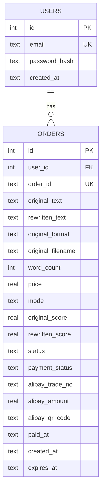

### 4.2 类图

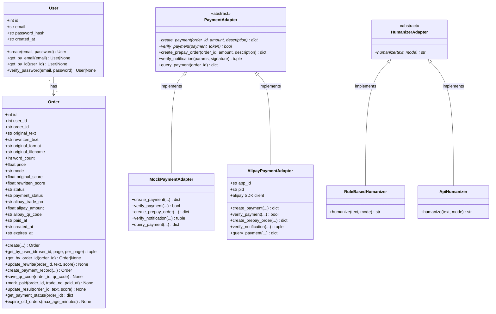

### 4.3 Schema SQL

```sql
CREATE TABLE users (
    id INTEGER PRIMARY KEY AUTOINCREMENT,
    email TEXT UNIQUE NOT NULL,
    password_hash TEXT NOT NULL,
    created_at TEXT NOT NULL
);

CREATE TABLE orders (
    id INTEGER PRIMARY KEY AUTOINCREMENT,
    user_id INTEGER REFERENCES users(id),
    order_id TEXT UNIQUE NOT NULL,
    original_text TEXT NOT NULL,
    rewritten_text TEXT,                -- NULL when payment pending
    original_format TEXT DEFAULT 'txt',
    original_filename TEXT,
    word_count INTEGER,
    price REAL,
    mode TEXT DEFAULT 'academic',
    original_score REAL,
    rewritten_score REAL,
    status TEXT DEFAULT 'pending',       -- pending/processing/completed/expired
    payment_status TEXT DEFAULT 'pending',  -- pending/paid/expired
    alipay_trade_no TEXT,
    alipay_amount REAL,
    alipay_qr_code TEXT,
    paid_at TEXT,
    created_at TEXT NOT NULL,
    expires_at TEXT NOT NULL
);
```

> **向后兼容**：`Order.init_table()` 在旧数据库上自动执行 `ALTER TABLE ADD COLUMN` 添加缺失字段。

---

## 5. API 接口

### 5.1 接口总览

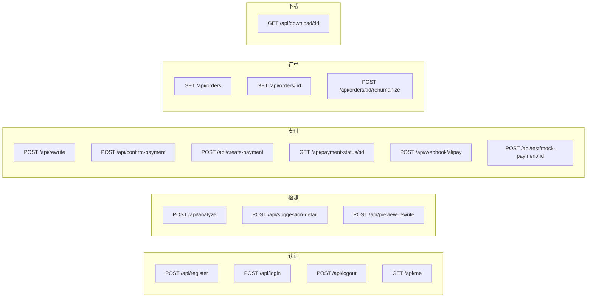

### 5.2 接口详情

#### 认证接口

| 方法 | 路径 | 请求体 | 响应 | 说明 |
|------|------|--------|------|------|
| POST | `/api/register` | `{email, password, confirm_password}` | `{success, user}` 或 `{error}` | 邮箱注册，密码 ≥6 位 |
| POST | `/api/login` | `{email, password}` | `{success, user}` 或 `{error}` | 邮箱密码登录 |
| POST | `/api/logout` | — | `{success}` | 清除 session |
| GET | `/api/me` | — | `{user}` 或 401 | 获取当前用户 |

#### 检测接口

| 方法 | 路径 | 请求体 | 响应 | 说明 |
|------|------|--------|------|------|
| POST | `/api/analyze` | `{text}` 或 multipart file | `{analysis, word_count, price}` | AI 检测，超限返回 413 |
| POST | `/api/suggestion-detail` | `{text, paragraph_index}` | 段落级分析+建议 | 逐段详细建议 |
| POST | `/api/preview-rewrite` | `{text}` | 首段改写预览 | 免费，≤200 词 |

#### 支付接口

| 方法 | 路径 | 请求体 | 响应 | 说明 |
|------|------|--------|------|------|
| POST | `/api/rewrite` | `{text, mode}` | `{order: {order_id, price}}` | 旧版改写（<600 词） |
| POST | `/api/confirm-payment` | `{payment_token}` | `{original, rewritten, improvement}` | 旧版确认支付+同步改写 |
| POST | `/api/create-payment` | `{text, mode}` | `{order: {order_id, qr_code}}` | 新版创建 QR 支付 |
| GET | `/api/payment-status/<id>` | — | `{payment_status, status, rewritten?}` | 轮询支付/改写状态 |
| POST | `/api/webhook/alipay` | 支付宝签名参数 | `"success"` / `"fail"` | 支付宝异步通知 |
| POST | `/api/test/mock-payment/<id>` | — | `{success}` | Mock 模拟支付 |

#### 订单接口

| 方法 | 路径 | 请求体 | 响应 | 说明 |
|------|------|--------|------|------|
| GET | `/api/orders` | `?page=&per_page=` | `{orders, total, page, pages}` | 分页订单列表 |
| GET | `/api/orders/<id>` | — | `{order}` 或 404/403 | 订单详情 |
| POST | `/api/orders/<id>/rehumanize` | `{mode}` | 重新改写结果 或 410 | 7 天内免费重改写 |
| GET | `/api/download/<id>` | `?format=docx\|pdf\|txt\|md` | File download | 格式保持下载 |

---

## 6. 核心流程

### 6.1 渐进式交互流程（核心路径）

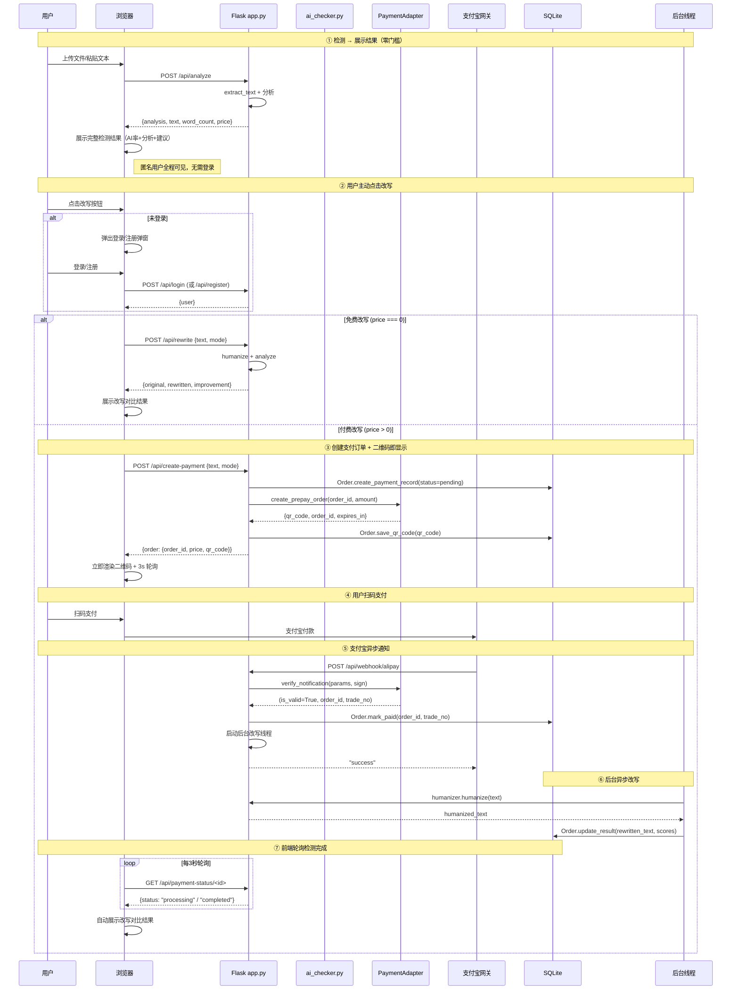

### 6.2 旧版模态框支付流程（<600 词，兼容路径）

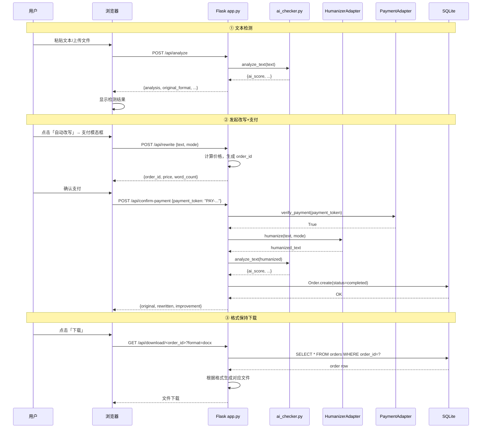

### 6.3 用户注册/登录流程

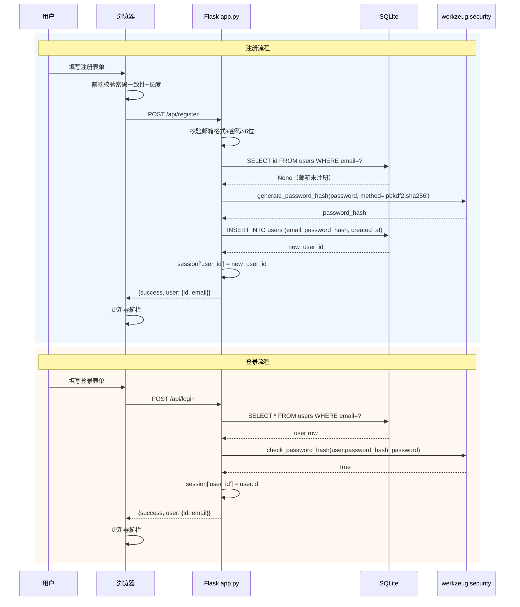

### 6.4 订单历史 + 7 天免费重改写

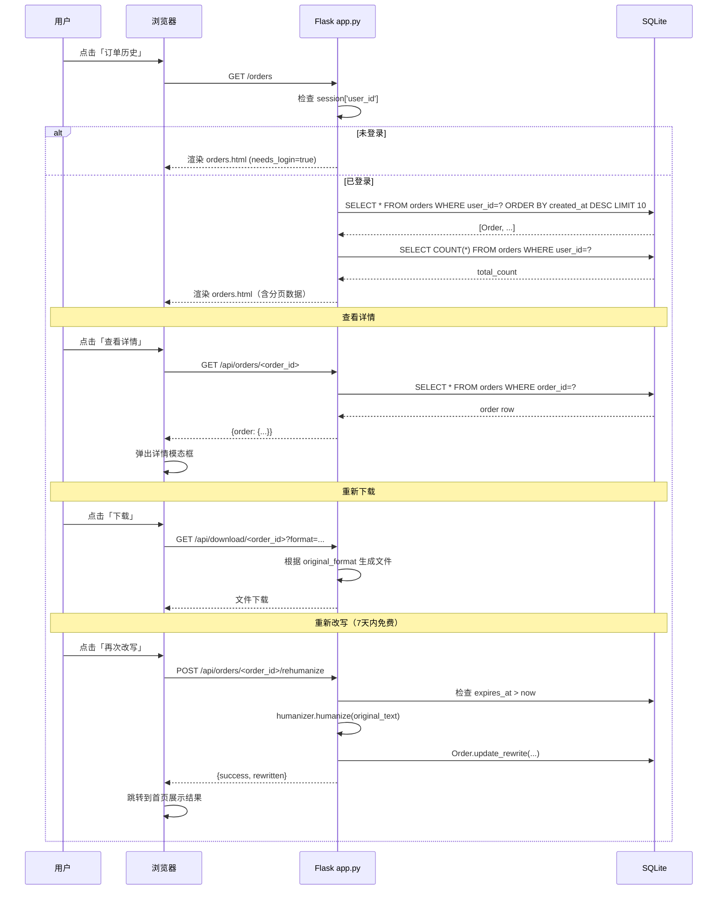

### 6.5 支付状态机

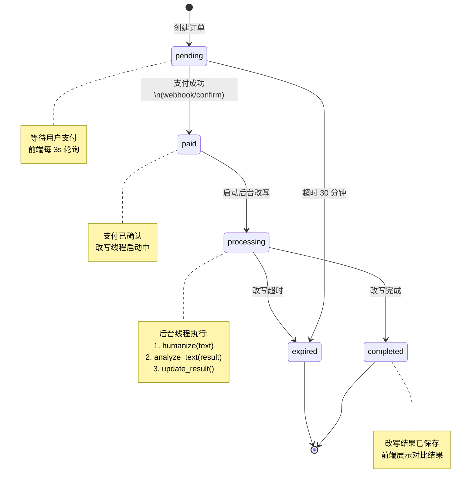

### 6.6 交互流程决策

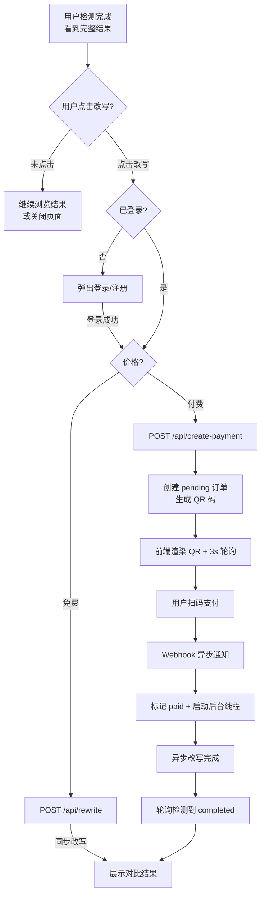

---

## 7. 检测引擎

### 7.1 五维加权评分模型

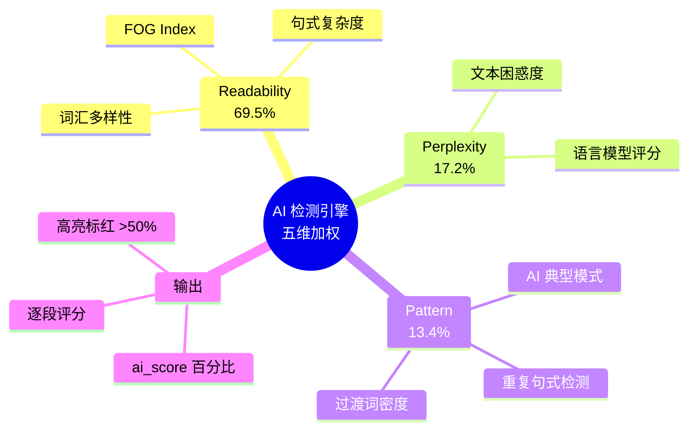

### 7.2 检测流程

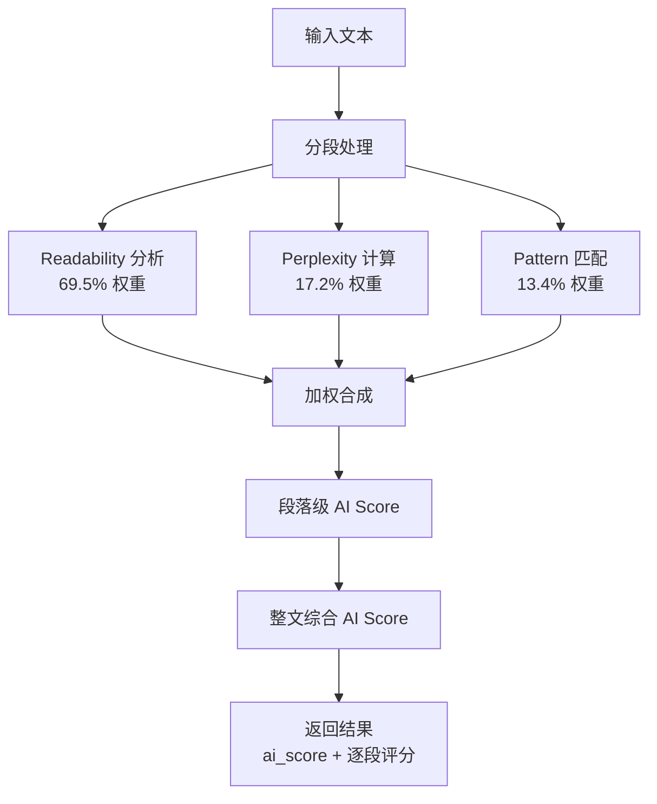

---

## 8. 改写引擎

### 8.1 6 种变换策略

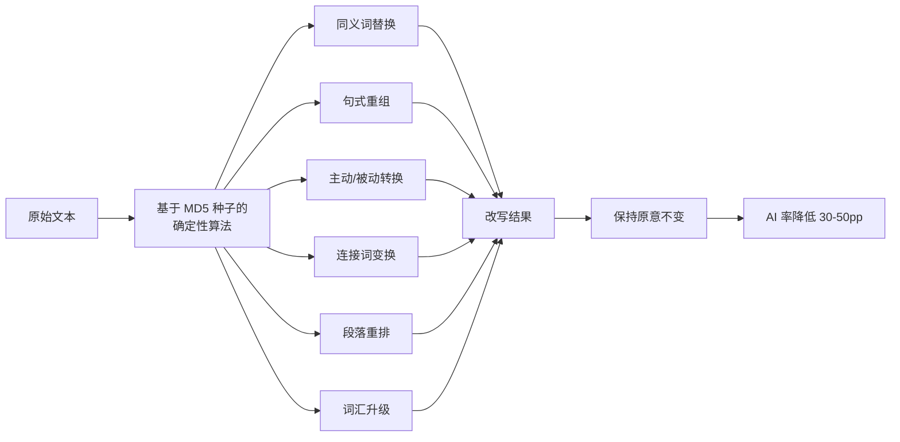

### 8.2 改写模式

| 模式 | 策略 | 效果 |
|------|------|------|
| `academic`（默认） | 全部 6 种策略均衡应用 | 学术文风保持 |
| `conservative` | 保守策略子集 | 最小改动，安全改写 |
| `deep` | 全部策略 + 深度重组 | 最大程度降 AI 率 |

---

## 9. 文件结构

### 9.1 项目目录

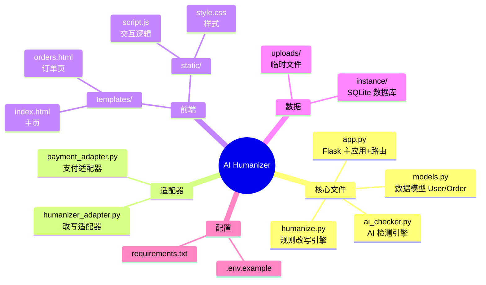

### 9.2 变更清单

#### 新增文件

| 文件 | 说明 |
|------|------|
| `models.py` | SQLite 数据模型 + `init_db()` + 支付方法 |
| `payment_adapter.py` | 支付适配器 (Mock + Alipay) |
| `humanizer_adapter.py` | 改写适配器 (RuleBased + Api 占位) |
| `templates/orders.html` | 订单历史页面 |

#### 修改文件

| 文件 | 变更内容 |
|------|----------|
| `app.py` | DB 初始化、auth 路由、QR 码支付、Webhook、异步改写、下载 API |
| `templates/index.html` | 导航栏改造、登录/注册模态框、FAQ 更新 |
| `static/script.js` | 登录/注册、QR 支付渲染、轮询、订单交互 |
| `static/style.css` | 模态框、QR 码区域、订单详情样式 |
| `requirements.txt` | 新增 alipay-sdk-python，版本号范围约束 |

#### 不变文件

| 文件 | 理由 |
|------|------|
| `ai_checker.py` | 检测逻辑无需修改 |
| `humanize.py` | 通过 adapter 包装调用 |

---

## 10. 共享约定

| 约定 | 值 |
|------|-----|
| **Session Key** | `session['user_id']` 存用户 ID；`session['last_text']` 服务端兜底；`sessionStorage.lastExtractedText` **前端主存**（避免 session 丢失导致文本不可用） |
| **订单号格式** | `ORD-` + uuid4 hex[:8].upper()，例 `ORD-A1B2C3D4` |
| **数据库路径** | `instance/aigc_humanizer.db` |
| **时间格式** | ISO 8601 UTC (`datetime.utcnow().isoformat()`) |
| **API 响应** | 成功: `{success: true, ...}`；失败: `{error: "消息"}` |
| **价格** | `PRICE_PER_1000_WORDS = 14.9`, `FREE_WORD_LIMIT = 200`, `FREE_DAILY_REWRITES = 2` |
| **密码安全** | `werkzeug.security.generate_password_hash` (pbkdf2:sha256) |
| **订单过期** | `expires_at = created_at + 7 days`；未支付 30 分钟过期 |
| **适配器配置** | `PAYMENT_ADAPTER=mock/alipay`, `HUMANIZER_ADAPTER=rule_based/api` |
| **QR 码有效期** | 预支付订单 30 分钟 |
| **轮询间隔** | 前端每 3 秒，最多 200 次（10 分钟） |
| **后台改写** | `threading.Thread(daemon=True)` |

---

## 11. 任务列表

| # | 任务 | 涉及文件 | 状态 |
|---|------|----------|------|
| T01 | 基础设施 + 数据层（DB 模型 + 支付适配器 + 改写适配器） | `models.py`, `payment_adapter.py`, `humanizer_adapter.py`, `app.py` | ✅ 已完成 |
| T02 | 后端认证系统 + 订单持久化路由 | `app.py`, `models.py` | ✅ 已完成 |
| T03 | 格式保持输出 + .md 支持 + 下载 API | `app.py`, `templates/index.html`, `static/script.js` | ✅ 已完成 |
| T04 | 前端登录/注册模态框 + 导航栏改造 | `templates/index.html`, `static/style.css`, `static/script.js` | ✅ 已完成 |
| T05 | 订单历史页面 | `templates/orders.html`, `static/style.css`, `static/script.js` | ✅ 已完成 |
| T06 | QR 码支付流程（支付宝当面付） | `app.py`, `payment_adapter.py`, `models.py`, `static/script.js` | ✅ 已完成 |
| T07 | 支付宝 Webhook + 异步后台改写 | `app.py`, `models.py` | ✅ 已完成 |

---

*文档整合于 2026-05-28。原始来源：ARCHITECTURE.md、product-doc.md（第3章技术架构）、class-diagram.mermaid、sequence-diagram.mermaid*
