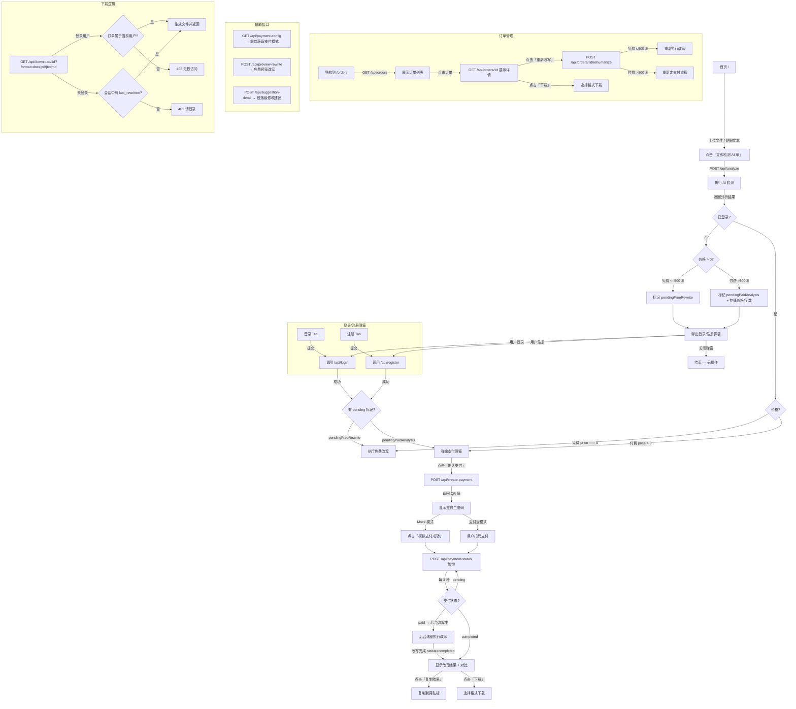

# 用户流程可视化



## 关键路径速览

### 路径 A：免费改写（≤500 词，未登录）
```
首页 → 检测 → 弹出登录 → 登录/注册 → 自动执行改写 → 显示结果
```

### 路径 B：免费改写（≤500 词，已登录）
```
首页 → 检测 → 立即执行改写 → 显示结果
```

### 路径 C：付费改写（>500 词，未登录）
```
首页 → 检测 → 弹出登录 → 登录/注册 → 弹出支付弹窗 → 扫码支付 → 轮询 → 显示结果
```

### 路径 D：付费改写（>500 词，已登录）
```
首页 → 检测 → 弹出支付弹窗 → 扫码支付 → 轮询 → 显示结果
```

## 后端关键路由表

| 路由 | 需登录 | 功能 | 触发时机 |
|------|--------|------|---------|
| `POST /api/analyze` | 否 | AI 检测 | 点击「立即检测」 |
| `POST /api/rewrite` | 是 | 免费改写 | 分析结果 → 免费 |
| `POST /api/create-payment` | 是 | 创建支付订单 | 点击「确认支付」 |
| `GET /api/payment-status/:id` | 是 | 轮询支付+改写状态 | 支付后 3 秒/次 |
| `POST /api/webhook/alipay` | 否(CSRF豁免) | 支付宝回调 | 支付宝异步通知 |
| `POST /api/test/mock-payment/:id` | 否 | 模拟支付成功 | Mock 模式测试 |
| `GET /api/orders` | 是 | 订单列表 | 导航到 /orders |
| `POST /api/orders/:id/rehumanize` | 是 | 重新改写 | 点击「重新改写」 |
| `GET /api/download/:id` | 视情况 | 下载结果 | 点击「下载」 |
| `GET /api/payment-config` | 否 | 获取支付适配器类型 | 页面加载 |

## Session 标记位

| 标记 | 设置位置 | 消费位置 | 用途 |
|------|---------|---------|------|
| `pendingFreeRewrite` | `handleAnalyzeResponse` | `auth.js` 登录/注册成功 | 登录后自动执行免费改写 |
| `pendingPaidAnalysis` | `handleAnalyzeResponse` / `createPaymentOrder` | `auth.js` 登录/注册成功 | 登录后自动弹出支付弹窗 |
| `pendingPaymentInfo` | `handleAnalyzeResponse` | `auth.js` 登录/注册成功 | 存储支付需要的字数/价格 |
| `last_text` | `api_analyze` | `api_rewrite` / `api_create-payment` | 改写和支付时读取文本 |