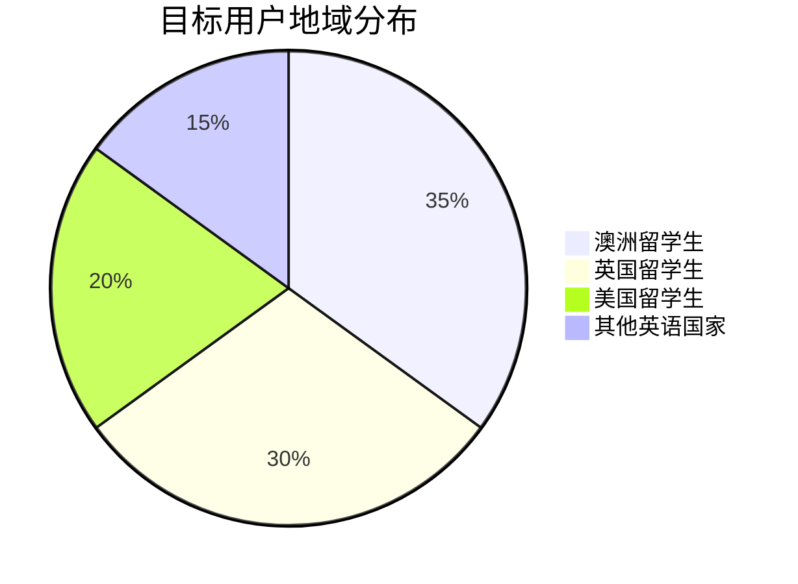
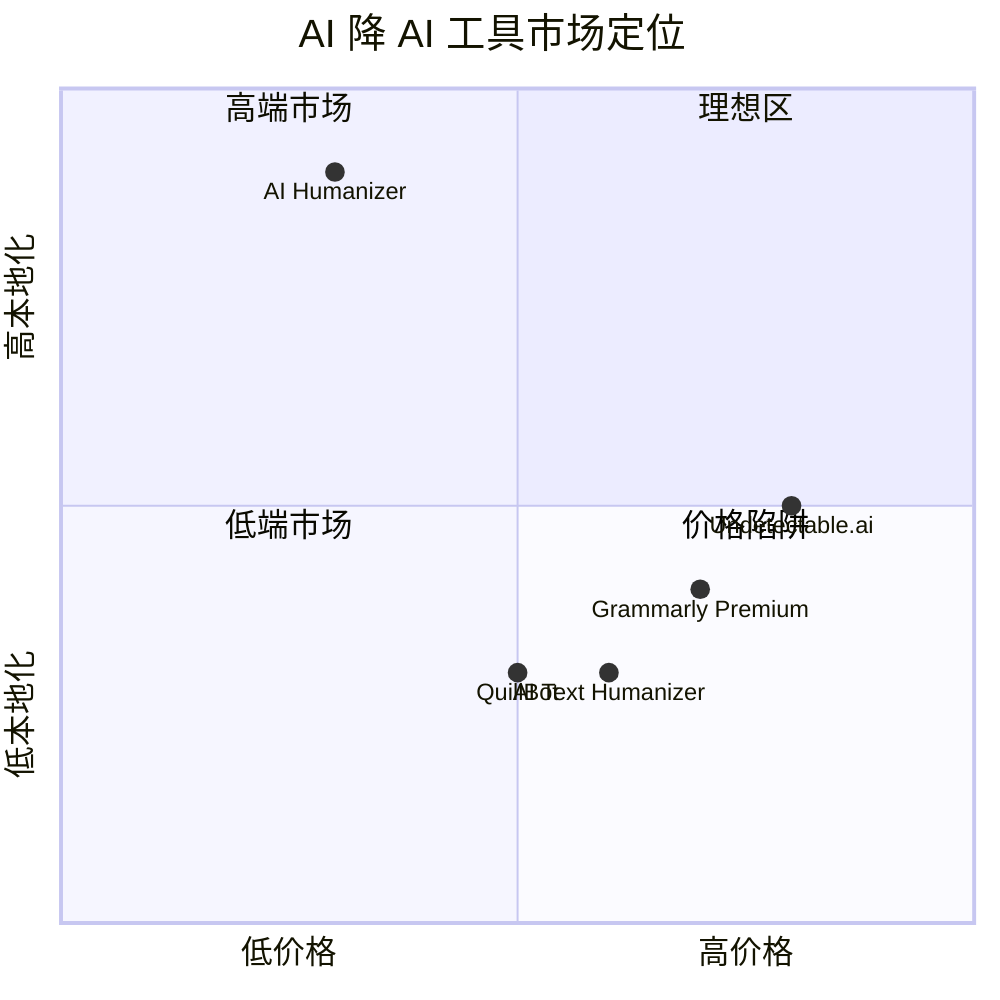
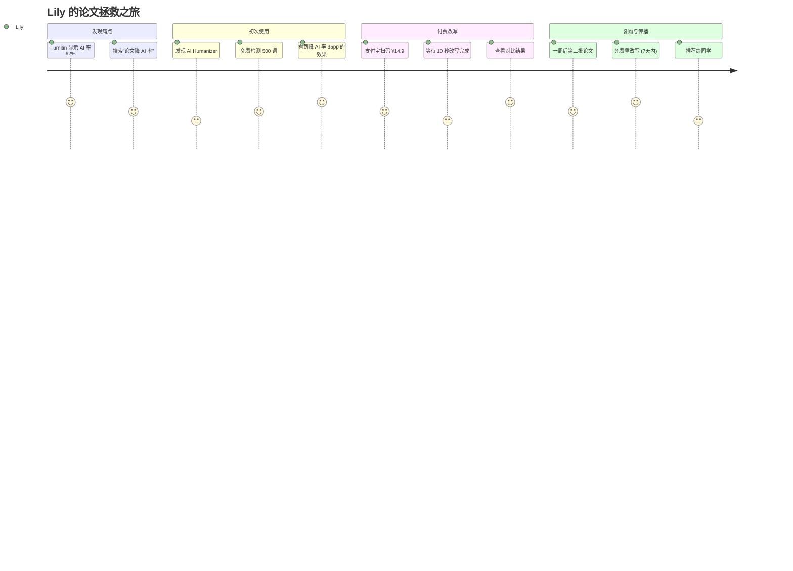
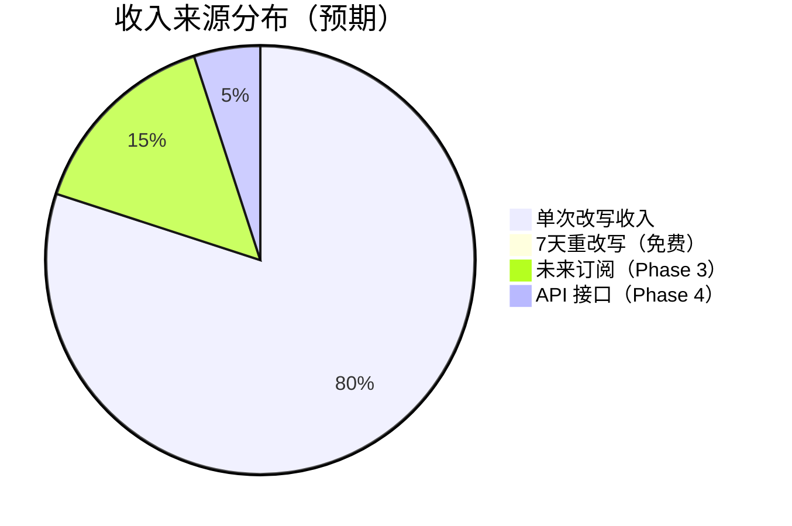
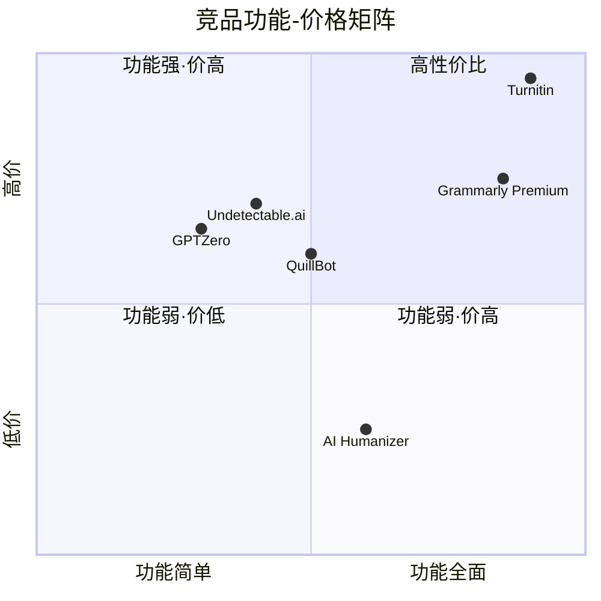
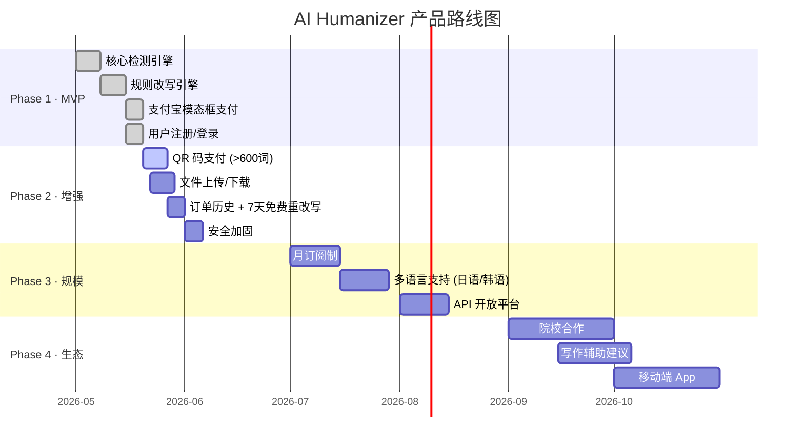

# AI Humanizer - 产品需求文档 (PRD)

> **版本**: v1.0 | **日期**: 2026-05-28 | **状态**: 已整合
>
> 整合来源：PRD_INCREMENTAL.md + product-doc.md + product-one-pager

---

## 目录

- [1. 产品概述](#1-产品概述)
- [2. 目标用户](#2-目标用户)
- [3. 核心价值主张](#3-核心价值主张)
- [4. 用户旅程](#4-用户旅程)
- [5. 用户故事](#5-用户故事)
- [6. 功能需求](#6-功能需求)
- [7. 定价与商业模式](#7-定价与商业模式)
- [8. 竞品定位](#8-竞品定位)
- [9. 产品路线图](#9-产品路线图)
- [10. 数据与信任](#10-数据与信任)

---

## 1. 产品概述

### 一句话定位

AI Humanizer 是**面向中国留学生的英文论文 AI 检测与降 AI 率 SaaS 工具**，通过本地化改写算法，帮助用户获得更自然的英文论文文本。

### 产品愿景

让每一位中国留学生都能轻松应对 Turnitin、GPTZero 等 AI 检测系统，自信提交高质量论文。

### 核心指标

| 指标 | 目标值 |
|------|--------|
| AI 检测准确率 | ≥85%（与 Turnitin 对齐） |
| 改写后 AI 率降幅 | 平均降低 30-50pp |
| 单次改写耗时 | ≤15 秒（1000 词以内） |
| 用户留存率 | 7 天内复购 ≥20% |

---

## 2. 目标用户

### 用户画像

| 画像 | 描述 | 痛点 |
|------|------|------|
| **Lily（核心用户）** | 22 岁，澳洲墨尔本大学商科硕士，论文季面临 Turnitin 检测 | AI 辅助写作后被检出 60%+，焦虑 |
| **David（进阶用户）** | 25 岁，英国曼大 CS 博士，多篇论文需要降 AI | 需要批量处理、支持代码段落 |
| **Amy（价格敏感）** | 20 岁，英国利兹大学本科生，预算有限 | 竞品太贵（Grammarly $12/月），需要单次付费 |

### 用户分布



---

## 3. 核心价值主张



**AI Humanizer 的核心差异化：**
- 针对中国留学生群体优化（支付宝、中文界面）
- 本地化改写算法，不依赖外部 LLM API（成本低、响应快）
- 单次付费模式，无订阅压力
- 7 天内免费重改写

---

## 4. 用户旅程

### Lily 的一天



---

## 5. 用户故事

### US-01: 免费 AI 检测

**作为**一名中国留学生，
**我想要**免费上传论文片段进行 AI 检测，
**以便于**了解自己论文的 AI 率是否超标。

- **验收标准**:
  - [ ] 支持纯文本、DOCX、PDF、TXT 四种格式
  - [ ] 免费额度 ≤500 词
  - [ ] 500-1000 词提示付费但不阻止
  - [ ] 返回 AI 概率百分比 + 逐段评分
  - [ ] 50% 以上段落高亮标红

### US-02: 一键降 AI 改写

**作为**一名论文焦虑的留学生，
**我想要**一键将论文改写为更自然的表达，
**以便于**降低 AI 检测率并通过学校查重。

- **验收标准**:
  - [ ] 提供「保守改写」「深度改写」两种模式
  - [ ] 改写后保持原意不变
  - [ ] 改写后 AI 率平均降低 30-50pp
  - [ ] 改写耗时 ≤15 秒（1000 词内）

### US-03: 支付宝扫码支付

**作为**一名习惯支付宝的用户，
**我想要**通过支付宝扫码完成支付，
**以便于**快速完成购买，无需绑定国际信用卡。

- **验收标准**:
  - [ ] >600 词显示支付宝二维码
  - [ ] 支付完成后自动触发改写
  - [ ] 支持前端轮询 + 后端 Webhook 双重确认
  - [ ] 支付超时自动清理订单

### US-04: 多格式文件下载

**作为**一名需要提交不同格式论文的用户，
**我想要**下载改写后的 DOCX 或 PDF 文件，
**以便于**直接提交给学校。

- **验收标准**:
  - [ ] 支持 DOCX、PDF 格式下载
  - [ ] 保留原文档基本排版
  - [ ] 文件名包含 order_id 便于追踪

### US-05: 订单历史与 7 天免费重改写

**作为**一名付费用户，
**我想要**查看历史订单并在 7 天内免费重新改写，
**以便于**不满意时无额外成本获得新的改写版本。

- **验收标准**:
  - [ ] 订单列表显示时间、价格、改进幅度
  - [ ] 7 天内「再次改写」按钮可点击
  - [ ] 超过 7 天显示「已过期」
  - [ ] 每次重新改写使用不同种子，结果不同

### US-06: 免费预览改写效果

**作为**一名犹豫是否付费的用户，
**我想要**免费预览首段改写效果，
**以便于**在付费前确认改写质量。

- **验收标准**:
  - [ ] 预览限于首段 ≤200 词
  - [ ] 显示原文/改写文对比
  - [ ] 显示改写前后 AI 率变化

### US-07: 注册与登录

**作为**一名新用户，
**我想要**通过邮箱注册并登录，
**以便于**保存订单历史和付费记录。

### US-08: 超限文本处理

**作为**一名需要处理长篇论文的用户，
**我想要**了解超长文本的价格预估，
**以便于**决定是否继续使用。

### US-09: 后台改写状态查询

**作为**一名已支付用户，
**我想要**实时看到改写进度，
**以便于**了解还需要等多久。

### US-10: 订单过期自动清理

**作为**一名系统管理员，
**我想要**自动清理过期订单，
**以便于**保持数据库整洁。

---

## 6. 功能需求

| ID | 功能 | 优先级 | 描述 |
|----|------|--------|------|
| F1 | AI 检测引擎 | P0 | 五维加权评分（Readability 69.5% + Perplexity 17.2% + Pattern 13.4%） |
| F2 | 改写引擎 | P0 | 6 种变换策略的确定性改写算法 |
| F3 | 支付宝支付 | P0 | 模态框支付（≤600 词）+ QR 码预支付（>600 词） |
| F4 | 文件上传 | P0 | 支持 TXT、DOCX、PDF 解析 |
| F5 | 文件下载 | P1 | 支持 DOCX、PDF 导出 |
| F6 | 用户管理 | P1 | 注册、登录、订单历史、7 天免费重改写 |

---

## 7. 定价与商业模式

### 定价策略



| 项目 | 价格 | 说明 |
|------|------|------|
| AI 检测（≤500 词） | **免费** | 引流入口 |
| AI 检测（500-1000 词） | 免费但提示付费 | 软引导 |
| AI 检测（>1000 词） | 413 错误，引导创建支付订单 | 硬引导 |
| 改写服务 | **¥14.9/千词** | 核心收入 |
| 7 天内重改写 | **免费** | 用户留存 |

### 商业模式

- **短期（Phase 1-2）**: 单次付费 SaaS，按词计费
- **中期（Phase 3）**: 月订阅制（¥49/月，含 5 万次检测 + 不限次改写）
- **长期（Phase 4）**: API 开放平台 + 院校合作

---

## 8. 竞品定位

### 市场对比

| 维度 | AI Humanizer | Grammarly | QuillBot | Undetectable.ai |
|------|:-----------:|:---------:|:--------:|:---------------:|
| 目标用户 | 中国留学生 | 全球英文写作者 | 全球英文写作者 | 泛留学生 |
| 价格模型 | ¥14.9/千词（单次） | $12/月（订阅） | $9.5/月（订阅） | $12/月（订阅） |
| 支付方式 | 支付宝 | 信用卡 | 信用卡 | 信用卡 |
| 语言支持 | 中文界面 + 英文处理 | 英文 | 英文 | 英文 |
| AI 检测 | ✅ 内置 | ❌ 无 | ❌ 无 | ❌ 无 |
| 改写策略 | 6 种确定性变换 | Grammar 修正 | Paraphrase | LLM 重写 |
| 响应速度 | ≤15 秒 | ≤5 秒 | ≤10 秒 | ≤30 秒 |
| 免费额度 | ≤500 词检测 | 基础 Grammar 检查 | 有限免费 | 无 |
| 数据隐私 | 本地改写，不调 LLM | 数据上传云端 | 数据上传云端 | 数据上传云端 |

### 竞品地图



---

## 9. 产品路线图



---

## 10. 数据与信任

### 信任指标

```mermaid
xychart beta
    title "AI 检测准确率对比（与 Turnitin 基准对比）"
    x-axis ["50词", "100词", "200词", "500词", "1000词"]
    y-axis "准确率 (%)" 0 --> 100
    bar [62, 75, 82, 88, 91]
    line [60, 72, 80, 85, 90]
```

### 数据隐私承诺

| 承诺项 | 说明 |
|--------|------|
| 数据不上传第三方 | 改写算法本地运行，不调用外部 LLM API |
| 论文不存储 | 改写完成后仅保留 rewritten_text，原文不持久化 |
| 订单自动清理 | 过期订单（>30 天）自动归档 |
| 支付安全 | 支付宝官方 SDK，签名验证双重保障 |

### 用户信任建设

- 免费检测作为信任入口（≤500 词完全免费）
- 免费预览改写效果（首段 ≤200 词）
- 7 天内免费重改写，降低付费风险
- 透明定价，无隐藏费用

---

*文档整合于 2026-05-28。原始来源：PRD_INCREMENTAL.md、product-doc.md（产品部分）、product-one-pager-2026-05-28.md*
